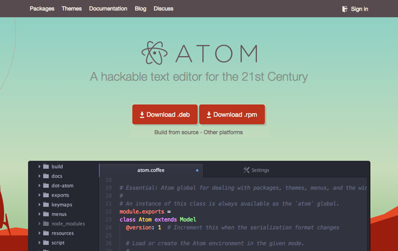
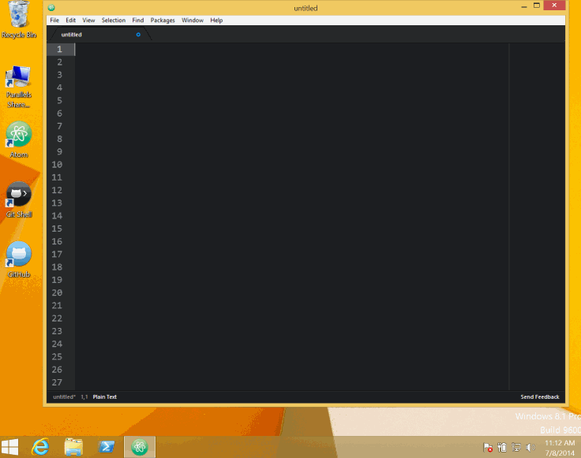

## 安装 Atom

想要使用 Atom，我们就得先安装它。这部分将会讲到如何在 Mac，Windows 和 Linux 上安装 Atom，以及如何从源码构建它。

在这些系统下安装 Atom 都很简单。访问 <https://atom.io> 后在页面顶部就能看到下载按钮。



图 1. atom.io 网站的下载按钮

这些按钮的文字和行为会自动对应你的操作系统，下载和安装都很方便。但我们还是一起详细看看吧！

### 给 Mac 安装 Atom

Atom 最初就是为 Mac 环境构建的，所以安装过程非常简单。可以直接点击 atom.io 网站上的下载按钮，也可以访问 Atom 的发布页：

<https://github.com/atom/atom/releases/latest>

直接下载 `atom-mac.zip` 文件。

待文件下载完成后，点击解压，然后拖拽解压出来的 `Atom` 程序到你的 「Applications」 文件夹。

当你第一次打开 Atom 时，它会尝试安装终端下使用的 `atom` 和 `apm` 命令。在某些情况下，可能会因为需要管理员密码而安装失败。要检查 `atom` 命令是否安装成功可以在终端运行 `which atom`，如果 `atom` 命令安装好了，会看到这样的输出：

```sh
$ which atom
/usr/local/bin/atom
$
```

如果 `atom` 命令没有安装，`which` 命令不会有输出：

```sh
$ which atom
$
```

想要自己安装 `atom` 和 `apm` 命令，可以在 Command Palette 运行 「Windows: Install Shell Commands」，会自动弹框询问你的管理员密码。（译注：Mac 下打开 Command Palette 的快捷键是 <kbd>shift</kbd>+<kbd>cmd</kbd>+<kbd>p</kbd>，Windows 下是 <kbd>ctrl</kbd>+<kbd>shift</kbd>+<kbd>p</kbd> 。）

### 给 Windows 安装 Atom

在 Windows 可以从 <https://atom.io> 获取 Windows Installer，也可以从 [Atom Releases](https://github.com/atom/atom/releases/latest) 下载 `AtomSetup.exe`。

它们会帮你安装好 Atom，将 `atom` 和 `apm` 命令添加到 `PATH` 环境变量，在桌面和开始菜单创建快捷方式，往右键菜单添加「Open with Atom」，让 Atom 能够在用户从「打开方式」里选取关联程序时可见。



图 2. Windows 下的 Atom

#### 便携模式

Atom 在 Windows 下有一种便携模式，允许将它自己、Settings、Packages 和缓存等都放置在可移动存储设备上，这将使你能很容易地把 Atom 拿到另一台机器使用，不用安装任何东西。

开始使用便携模式的 Atom：

1. 从 [Atom Releases](https://github.com/atom/atom/releases/latest) 下载 `atom-windows.zip`
2. 将 `atom-windows.zip` 解压到你的可移动存储设备
3. 从解压出来的 Atom 文件夹里启动 `atom.exe`
4. 当 Atom 启动后它会在 `%USERPROFILE%` 下创建 `.atom` 文件夹
5. 将 `.atom` 文件夹和可移动存储设备里的 Atom 文件夹放到一起

现在不管你何时从你的可移动存储设备启动 `Atom.exe`，就会进入便携模式，所有的 settings 和 packages 都会保存到 `.atom` 文件夹。

注意便携模式有几点限制：

* 没有集成到资源管理器，没有为命令行命令设置 PATH 环境变量
* `.atom` 文件夹必须放在包含 `atom.exe` 的文件夹的同级（不是里面）
* `.atom` 文件夹必须是可写的
* 不能有 ATOM_HOME 环境变量（这将覆盖便携模式的行为）

### 给 Linux 安装 Atom

在 Linux 下安装 Atom，你可以从 [Atom 主页](https://atom.io/) 或者 [Atom 项目发布页](https://github.com/atom/atom/releases) 按需下载 [Debian package](https://atom.io/download/deb) 或 [RPM package](https://atom.io/download/rpm)。

在 Debian 下可以使用 `dpkg -i` 安装 Debian 软件包：

```sh
$ sudo dpkg -i atom-amd64.deb
```

在 RedHat 或者其它基于 RPM 的系统，可以使用 `rpm -i` 命令：

```sh
$ rpm -i atom.x86_64.rpm
```

### 从源码构建 Atom

如果上面这些方案都不适用于你的环境，或者你只是想试一试，那么也可以从源码构建 Atom。

这个链接里有最新的详细构建教程，有 Mac、Windows、Linux 和 FreeBSD 几种版本：

<https://github.com/atom/atom/tree/master/docs/build-instructions>

一般来讲，你需要使用 Git、C++ 工具链和 Node 去构建 Atom，上面的项目的文档里有详细介绍。

### 配置代理

如果你在使用代理，那可以通过设置 `~/.atom/.apmrc` 文件里的 `https-proxy` 字段来配置 [apm](https://github.com/atom/apm)（Atom Package Manager）：

```
https-proxy = https://9.0.2.1:0
```

如果你开启了防火墙并且在安装 packages 时看到 SSL 错误，那可以在 `~/.atom/.apmrc` 里添加这样一行来禁用对 SSL 证书的检查：

```
strict-ssl = false
```

你可以使用 `apm config get https-proxy` 来验证代理是否设置成功，使用 `apm config list` 来列出所有自定义设置。
