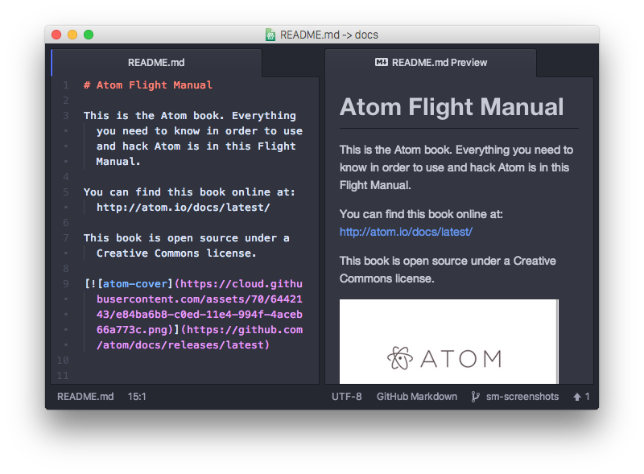

<!-- 译者：Github@wizardforcel -->
<!-- 校对：zxning -->

# 在 Atom 中写作 #

虽然 Atom 通常可能用来编写代码，其实它还可以用来高效地编写文章。这通常使用某种标记语言来完成，比如说 Asciidoc 和 [Markdown](https://help.github.com/articles/about-writing-and-formatting-on-github/) （也就是编写这个手册所用的语言）。下面我们来快速浏览一下 Atom 提供的用来写文章的一些工具。

在下面的文档里，我们将主要介绍如何使用 Markdown 进行写作；当然，像 Asciidoc 之类的标记语言也有 packages 实现类似的功能。

## 拼写检查 ##

如果你在处理文本（包括纯文本文件，Github Markdown 和默认的 Git 提交信息），Atom 会自动检查你的拼写。

任何拼写错误的单词都会高亮显示（默认在拼写错误的单词下方显示红色下划虚线），此时你可以按下 `Cmd+Shift+;` 就会弹出可能正确的菜单进行查看（译者注：将鼠标放在想要做拼写检查的地方，然后按下 `Cmd+Shift+;` 即可弹出拼写检查的菜单）（或者从右键快捷菜单，或 Command Palette 中选择“Correct Spelling”进行查看）。


如果想要 Atom 对更多的文件类型进行拼写检查，可以在设置面板中打开 Spell Check package 的设置，然后添加任何你希望检查的语法。

默认会做拼写检查的语法有 `text.plain`, `source.gfm`, 和 `text.git-commit` ，但是你可以添加 `source.asciidoc` 的语法，如果你希望也检查这种类型的文件。


拼写检查功能在 [spell-check](https://github.com/atom/spell-check) package 中实现。

## 预览 ##

使用标记语言编写文章的时候，我们能够对内容渲染后的样式有所了解，这还是很有用的。Atom 中默认带有 Markdown 预览插件。

- `Ctrl+Shift+M` -为 Markdown 预览模式的开关。



在你编辑文本时，预览会自动更新。这样你在输入时检查语法就变得相当容易了。

你也可以从预览面板中，复制渲染后的 HTML 到系统剪贴板中。这个操作没有任何快捷键，但是你可以在 Command Palette 中通过搜索“Markdown Preview Copy HTML”来找到它。

Markdown 预览在 [markdown-preview](https://github.com/atom/markdown-preview) package 中实现。

## 代码段 ##

有很多好用的代码段是为快速编写 Markdown 准备的。

如果你输入 `img` 之后按下 `tab` ，你会得到像 `` 这样的 Markdown 风格的嵌入图片代码。如果你输入 `table` 之后按下 `tab` ，你会得到一个非常棒的待填充的示例表格。

```
| Header One     | Header Two     |
| :------------- | :------------- |
| Item One       | Item Two       |
```

虽然用于 Markdown 的代码段不多（ `b` 粗体， `i` 斜体， `code` 代码块，等等），但它们会节省你用于寻找难懂的语法的时间。另外，你可以按下 `Alt+Shift+S`，来寻找当前文件类型可用的代码段列表。
